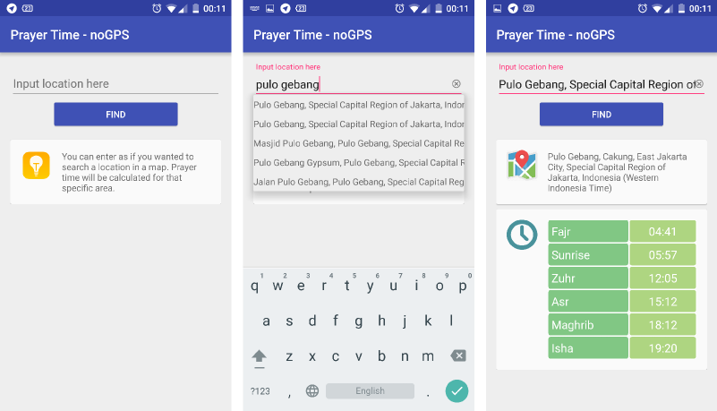

# PrayerTime-noGPS
An Android app for calculation of Islamic prayer times with manual location input as alternative approach to using device GPS sensor.

This tool uses the previously created JAR/library -- JPrayerTime.

